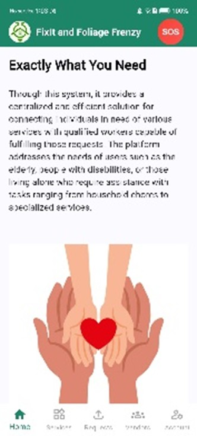
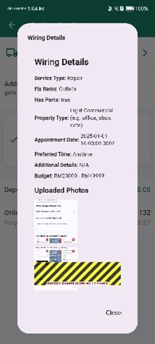
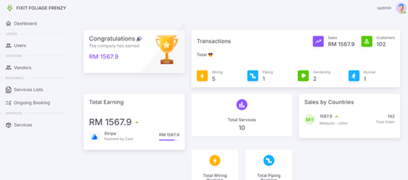
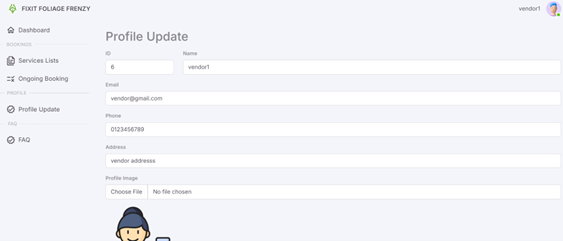

### 🏠 Household Service Booking System
A full-stack household service booking application designed to streamline service requests, provider management, and administrative operations. This project includes both a user-facing booking platform and a web-based admin panel for system maintenance and monitoring.

### 🎥 Project Demo
[Watch Demo Video](https://youtu.be/rMYTqgY70k4?si=2CefpEX1VxUEaMEf)

### 📱 System Highlights

  
  
  
  

  <em>User • Booking • Admin Dashboard • Vendor Profile</em>

🔗 **View UI Screenshots:**  
[UI Screenshots](https://github.com/TLeeQi/FFF_FYP/tree/main/screenshots)

> Includes User App, Vendor Portal, and Admin Dashboard interfaces.

### 📌 Overview
This Final Year Project focuses on solving inefficiencies in traditional household service booking by providing a centralized digital platform where users can:
- Book household services (wiring, plumber, gardening, runner service)
- Manage appointments
- Track booking status in real-time
This system supports a role-based access control (RBAC) system with multiple user levels: User, Vendor, Admin, and Super Admin.
  
### 🚀 Features
### 👤 User Application
- Service browsing & booking
- Real-time booking status tracking
- User authentication & profile management
- Appointment scheduling
### 🧑‍🔧 Vendor Portal (Service Provider)
- Manage incoming bookings
- Update service status (e.g. accepted, in progress, completed)
- Vendor profile management
- Identity verification via document (e.g. SSM) submission
- View booking history & service requests
### 🛠️ Admin Web Panel
- Dashboard for system overview
- Manage users, vendors & service providers
- Approve vendor registration (SSM verification)
- Booking management & monitoring
- Data maintenance & control
### 👑 Super Admin Panel
- Manage all admin accounts
- Assign and update admin roles & permissions
- Control system-level access and privileges
- Oversee administrative activities
  
### 🧠 AI Usage 
This project incorporates AI-assisted development practices:
- AI-assisted code generation for rapid prototyping
- Manual debugging, refinement, and system integration
- Test case generation with further human validation and optimization
👉 Demonstrates practical usage of AI as a development tool rather than full dependency.

### 🏆 Achievements
🥇 Gold Award & Best Presenter Award – I-RICE 2025
🥇 Gold Award (Project) & 🥉 Bronze Award (3-Minute Thesis) – Virtual Innovation Competition 2025
🥇 Gold Medal – International Invention, Innovation and Design Competition 2024
🥇 Gold Award – JIICaS 2024

### 📜 Intellectual Property
✅ Granted Copyright

### 🛠️ Tech Stack
- Frontend: Flutter
- Backend: Laravel
- Database: MySQL
- Admin Panel: Web-based dashboard
  
### 📂 System Architecture
- User Application (Client-side)
- Backend API Layer
- Admin Web Dashboard
- Database System

### 📈 Project Highlights
- Full-stack implementation (end-to-end system)
- Real-world problem solving (service booking inefficiency)
- Dual-platform system (User + Admin)
- Award-winning innovation project
- Production-like system structure

### 📬 Contact
If you are interested in this project or collaboration, feel free to reach out.
